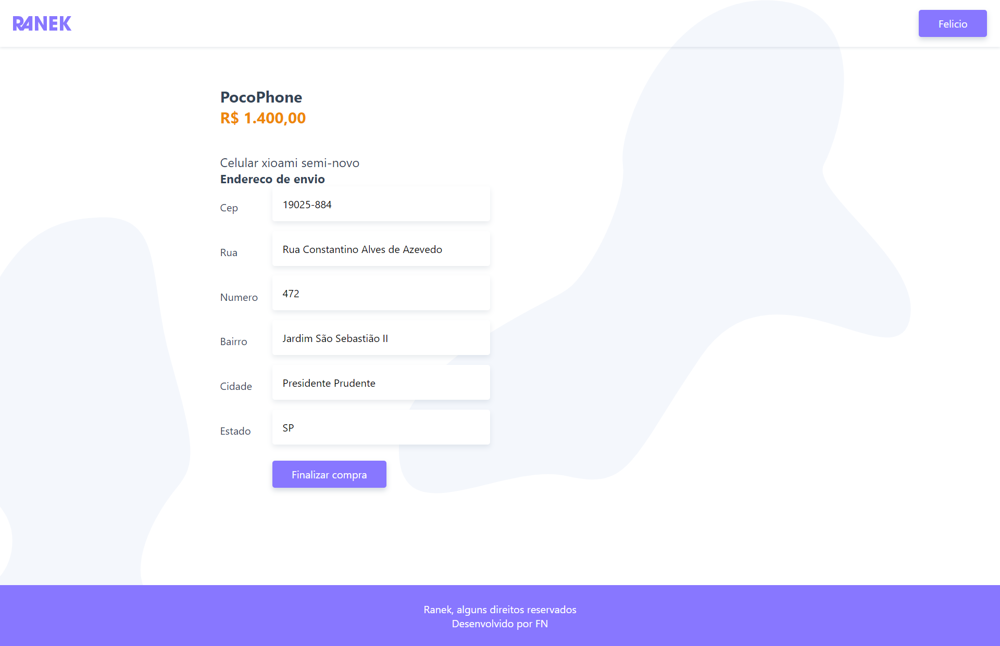
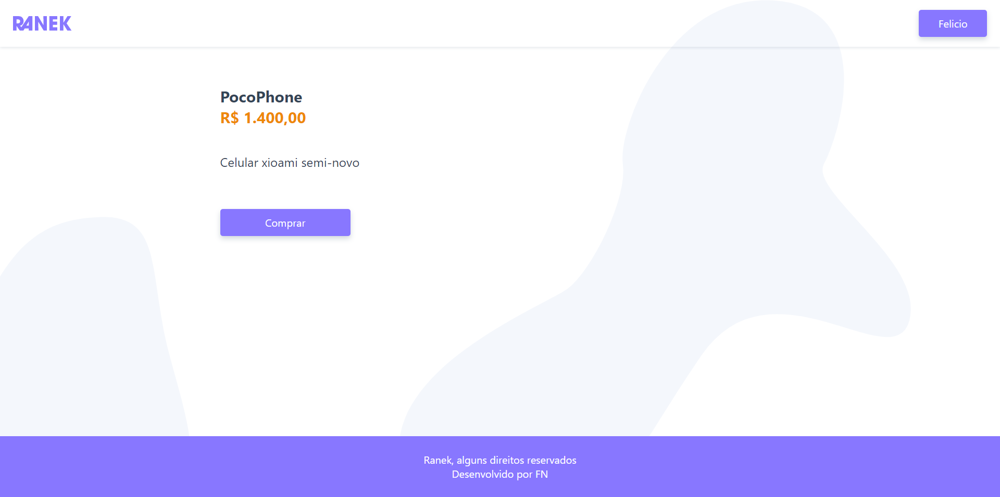
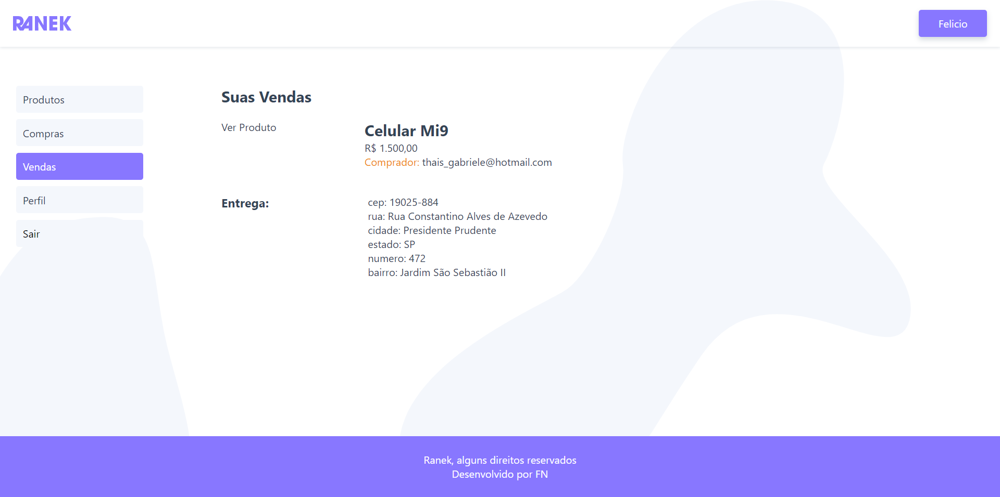
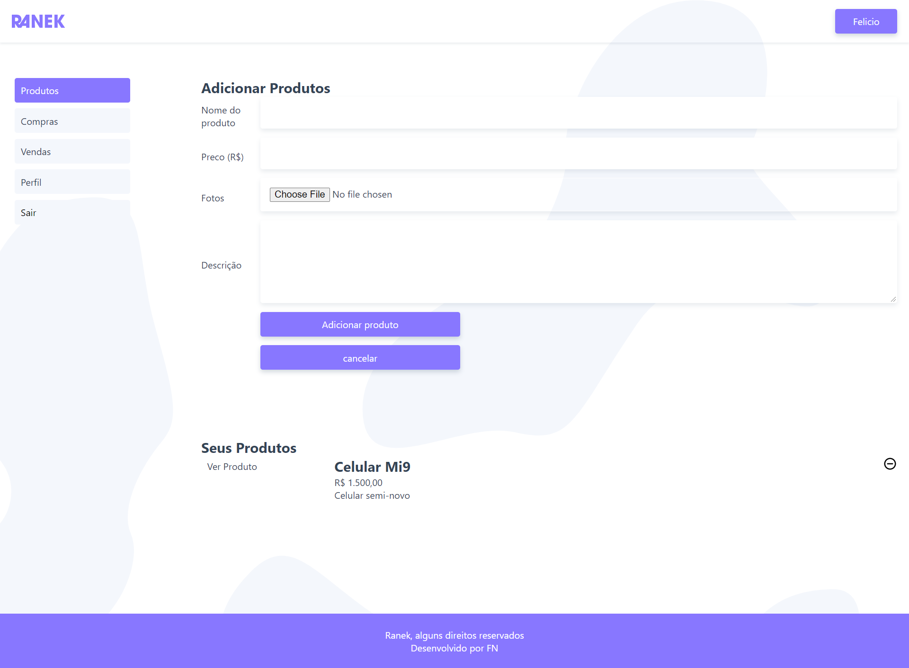
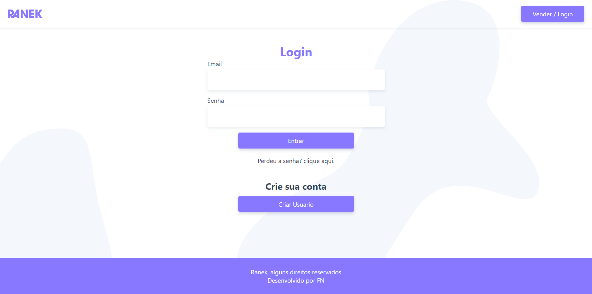
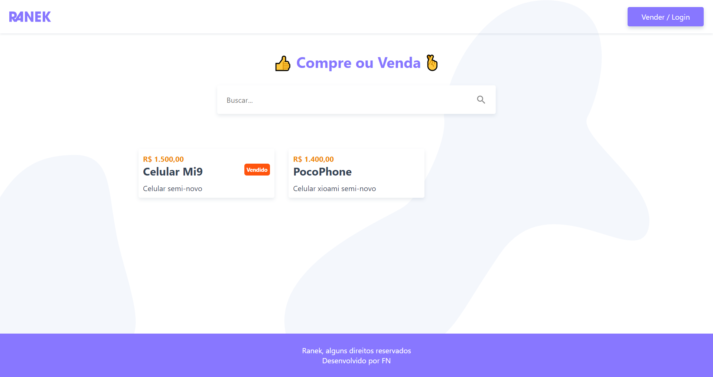

<h1 align="center">ranekAnnouncement</h1>
<i>Status: completo</i>

## Descrição

Projeto desenvolvido para fins educacionais, afim de consolidar todo o conteudo absorvido durante os estudos com mini-cursos, blogs, publicações, documentações e livros.

## Sobre

Parte de front de um sistema de compra e venda.

### Instalação

```
npm install
```

### Compilação

###### Developer

```
npm run serve
```

###### Api

```
json-server api.json
```

###### Production

```
npm run build
```

### Recursos

- [x] Adicionar produto
- [x] Remover produto
- [x] Editar produto
- [x] Cadastrar usuario
- [x] Editar usuario
- [x] Realizar compra
- [x] Verificar transações

### Tecnologias

- Vue.js
- Javascript
- HTML
- Css

### Projeto

<table>
<tr>
<td></td> 
<td></td>
<td></td>  
<tr>
<tr>
<td></td> 
<td></td>
<td></td>  
<tr>
</table>

### Contribuição

- Felicio F. M. Neto
